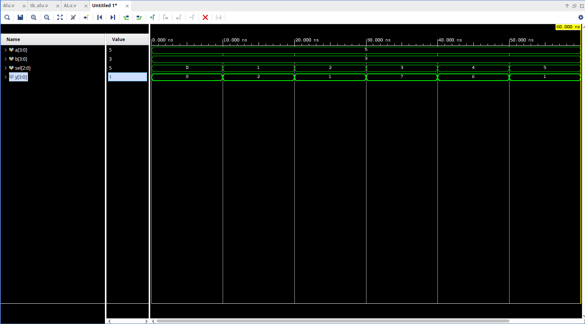
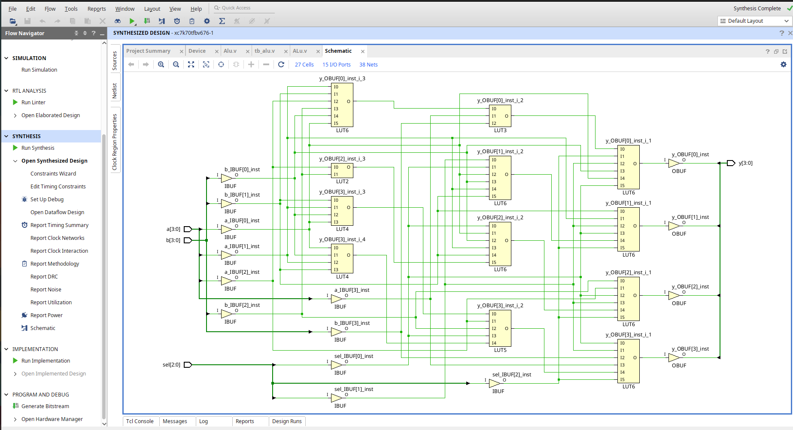

# ALU Design using Verilog HDL

4-bit ALU implemented and verified using Vivado.

## Features
- Addition
- Subtraction
- AND
- OR
- XOR
- Comparator

## Tools Used
- Vivado 2025.2
- Verilog HDL

## Simulation Waveform

## Synthesized RTL Schematic

